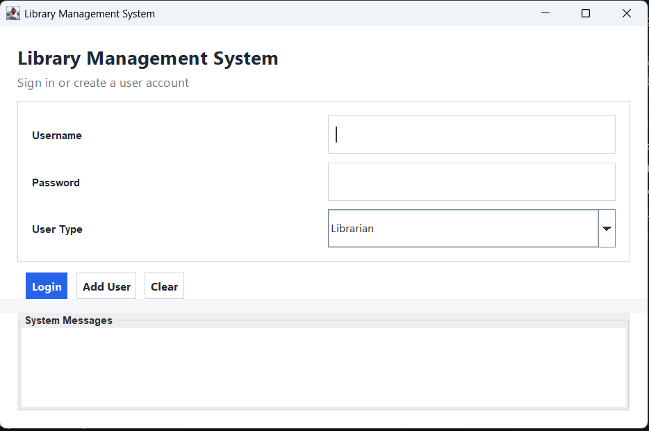
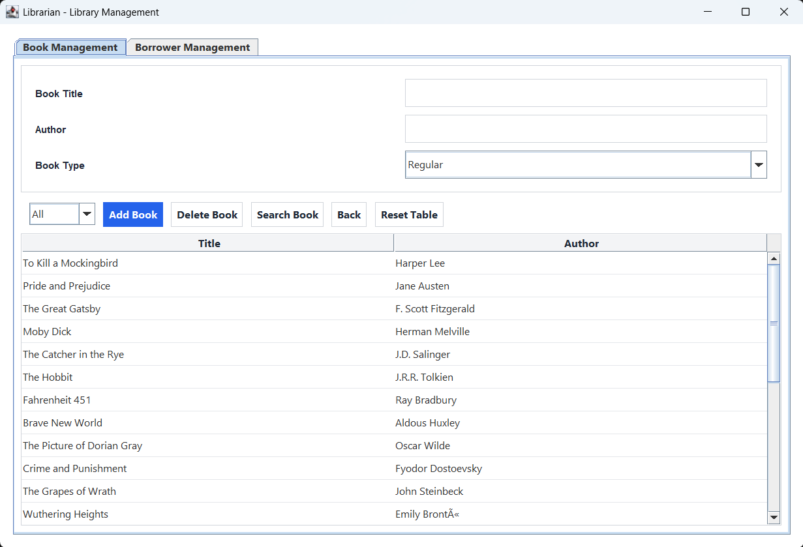
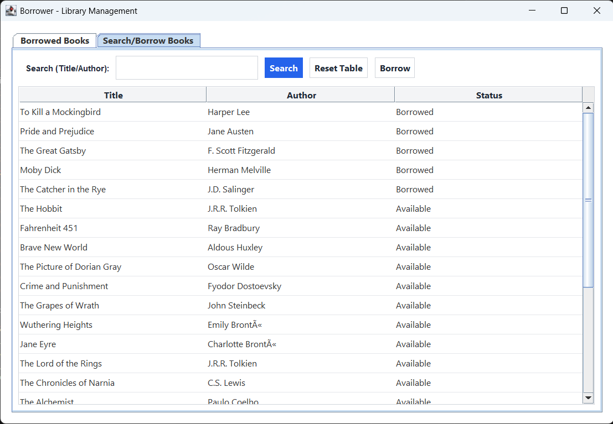
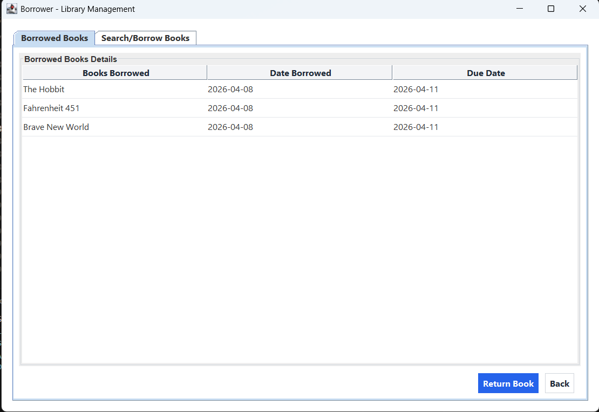

# Library Management System

## Project Description
Library Management System is a desktop Java application built with Swing to manage books, users, and borrowing records.  
It supports two user roles:
- **Librarian** for managing books and borrower records
- **Borrower** for searching, borrowing, and returning books

The project follows object-oriented design patterns and is suitable as a learning project or portfolio showcase.

## Features
- User authentication with role selection (Librarian / Borrower)
- Add and manage users
- Add, search, filter, and delete books (with duplicate checks)
- Borrow and return books
- Borrowed books tracking with due dates
- Overdue and reminder notifications
- Book type support (Regular, Bestseller, E-Book)
- Tab-based desktop UI for librarian and borrower workflows

## Technologies Used
- **Java** (core language)
- **Java Swing / AWT** (desktop UI)
- **File-based persistence** (`books.txt`, `users.txt`, `borrowed_books.txt`)
- **Apache Ant** (`build.xml`) for build/run support
- **NetBeans project metadata** (`nbproject`)

## Installation Instructions
### Prerequisites
- Java JDK 8 or later
- Apache Ant (optional, if building with Ant)
- Any Java IDE (NetBeans, IntelliJ IDEA, Eclipse) or terminal

### Clone and Open
```bash
git clone https://github.com/HenriDillo/LibraryMain.git
cd LibraryMain
```

If you are using an IDE, open the project folder directly.

## How to Run the Project
### Option 1: Run with Ant
```bash
ant clean
ant run
```

### Option 2: Run manually from terminal
```bash
javac -d out src/librarymain/*.java
java -cp out librarymain.LibraryMain
```

### Option 3: Run from IDE
Run `LibraryMain.java` as the main class.

## Project Structure
```text
LibraryMain/
|- src/
|  |- librarymain/
|     |- LibraryMain.java
|     |- LibraryGUI.java
|     |- LibrarianGUI.java
|     |- BorrowerGUI.java
|     |- Database.java
|     |- BookDatabase.java
|     |- UserDatabase.java
|     |- BorrowedBooksDatabase.java
|     |- ... (models, decorators, observers, and helpers)
|- test/
|- books.txt
|- users.txt
|- borrowed_books.txt
|- build.xml
|- README.md
```

## Screenshots
Add image files to a `screenshots/` folder in this repository, then they will render below:

### Login screen


### Librarian dashboard


### Borrower dashboard


### Borrowed books table


## Author
- **Henri**  
  GitHub: `https://github.com/HenriDillo`

## License
This project is available under the **MIT License**.  
You can add a `LICENSE` file to the repository for full license text.
